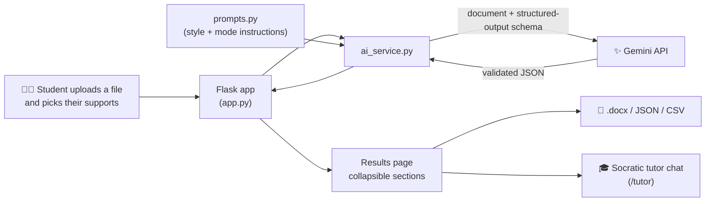

<div align="center">


# ReframeAI

### Where reading meets clarity.

**Upload a dense document. Get back something a human brain can actually digest.**

Built by **team ManeFrame** for **VTHacks 14 (2026)** · Focus: digital accessibility

View Here: https://reframeai-vtty.onrender.com/


[Watch the demo](#-demo-time) · [Run it locally](#-run-it-yourself) · [How it works](#-how-it-works) · [Meet the team](#-team-maneframe)

</div>

---

## 🧠 Who is this even helping?

Textbooks are formatted to cram in as much information as possible. Tiny text, giant paragraphs, and vocabulary that sends you to a search engine every third sentence.

For students with **ADHD**, **dyslexia**, and other learning disabilities, that layout isn't just annoying. It causes cognitive overload, and after enough of it, a lot of students start to believe *they're* the problem. They aren't. The formatting is.

**ReframeAI "reframes" study materials** so they're easier to read, easier to focus on, and easier to learn from, without dumbing anything down.

## ✨ What it does

| | Feature | What you get |
|---|---|---|
| ✍️ | **Plain-language rewrite** | The *entire* document rewritten at about a 7th-grade reading level: short sentences, one idea each, no idioms or sarcasm. Same structure, same facts, nothing invented. |
| ⚡ | **ADHD-friendly mode** | Extra brief, most important idea first, at most 4 key points, and next steps that start with an action verb. |
| 🔠 | **OpenDyslexic font toggle** | One checkbox switches the whole page and your results to the OpenDyslexic typeface. |
| 🖼️ | **Image descriptions for screen readers** | Diagrams, charts, and photos get detailed, self-contained descriptions: layout, labels, visible text, and data trends. Not "an image of a chart." |
| 🎓 | **Socratic tutor mode** | Instead of handing over answers, the tutor asks guided questions and gives hints so you actually learn the material. It has a question list *and* a live chat, both grounded only in your document. |
| 🗂️ | **Digestible results** | Everything lands in collapsible sections: main idea, detailed summary, key points, important words, next steps. No wall of text. |
| 📥 | **Take it with you** | Download a printable **Word (.docx)** file, or grab the results as **JSON** or **CSV**. |

**Accepted files:** PDF · Word (.docx) · TXT · Markdown · PNG · JPG · WEBP (up to 25 MB)

## 🎬 Demo time!

[](docs/reframeai-demo.mp4)

**▶️ [Watch the full 4-minute demo](docs/reframeai-demo.mp4)** (click the preview above too, we won't tell).

In the full walkthrough we:

1. Upload a real PDF ("How To Make an Ethernet Cable") and generate a plain-language version.
2. Flip on **OpenDyslexic** and watch the whole UI change.
3. Turn on **Socratic tutor mode** and get *guided questions* instead of spoilers.
4. Chat with the tutor, which nudges us toward the answer without just giving it away.
5. Upload a photo and have **image descriptions** generated for screen-reader users.

## 🔧 How it works



- **Gemini reads the file directly.** PDFs and images go to Gemini as-is (so it can *see* diagrams and charts). Word, TXT, and Markdown files are extracted to text first.
- **Structured output.** Gemini is forced to answer in a Pydantic-defined JSON schema, so the front end never has to guess what it's getting back.
- **Low temperature (0.3)** keeps the rewrite faithful to the source. The system prompt tells the model never to invent facts, dates, numbers, or names, and to say so when the document is unclear.
- **Friendly failure.** Busy API? It retries with backoff. Something breaks? Students get a plain-English message, not a stack trace.
- **Prompts live in one file** (`ai/prompts.py`), so anyone on the team can tune the tone without touching code.

## 🛠️ Tech stack

| Layer | Tools |
|---|---|
| **AI** | Google Gemini API via `google-genai` (default model `gemini-2.5-flash`), Pydantic structured output |
| **Back end** | Python, Flask, `python-docx` for Word export, Gunicorn |
| **Front end** | Vanilla HTML, CSS, and JavaScript. No framework, no build step. |
| **Accessibility** | OpenDyslexic font, semantic HTML, ARIA live regions, alt text on every image |
| **Hosting** | Render (`render.yaml`) |

## 📁 Project structure

```
.
├── app.py               # Flask app: serves the UI + /summarize, /tutor, /download
├── ai/
│   ├── ai_service.py    # every Gemini call lives here
│   ├── prompts.py       # all prompt text and style options
│   └── test_ai.py       # try the AI on its own, no front end needed
├── templates/
│   └── index.html       # the single-page UI
├── static/
│   ├── app.js           # upload, results, exports, tutor chat
│   └── styles.css       # calm palette, focus states, OpenDyslexic styles
├── images/              # ManeFrame logo + UI art
├── backend/             # original API scaffold + Render/Gunicorn entrypoint
├── docs/                # demo video + preview
├── requirements.txt
└── render.yaml
```

## 🚀 Run it yourself

**You'll need:** Python 3.10+, Git, and a free Gemini API key from [Google AI Studio](https://aistudio.google.com/apikey).

**1. Clone the repo**

```bash
git clone https://github.com/tori-n-m/vthacks2026.git
cd vthacks2026
```

**2. Set up a virtual environment and install dependencies**

```bash
python -m venv .venv
source .venv/bin/activate        # Windows: .venv\Scripts\activate
pip install -r requirements.txt
```

**3. Add your API key**

Create a file named `.env` in the repo root:

```env
GEMINI_API_KEY=your_key_here
# optional: swap the model without touching code
# GEMINI_MODEL=gemini-2.5-flash
```

> ⚠️ `.env` is already in `.gitignore`. Never commit your real key.

**4. Start the app**

```bash
python app.py
```

Open **http://localhost:5000** and upload something scary-looking.

**Just want to poke the AI?** Skip the web app entirely:

```bash
python ai/test_ai.py                       # built-in sample text
python ai/test_ai.py notes.pdf             # a real file
python ai/test_ai.py notes.pdf adhd        # pick a style: general | dyslexia | adhd
```

### ☁️ Deploying

`render.yaml` is set up for [Render](https://render.com). Create a web service from this repo and add `GEMINI_API_KEY` as an environment variable in the Render dashboard.

## 🔌 API endpoints

| Method | Endpoint | What it does |
|---|---|---|
| `GET` | `/` | The web app |
| `GET` | `/styles` | Lists the available rewrite styles |
| `POST` | `/summarize` | Takes a file plus options and returns the simplified results |
| `POST` | `/tutor` | One Socratic tutor turn, grounded in the uploaded document |
| `POST` | `/download` | Turns results into a downloadable `.docx` |

**`POST /summarize`** (`multipart/form-data`)

| Field | Description |
|---|---|
| `document` | The file to simplify (required) |
| `style` | `general` or `adhd` |
| `describe_images` | `on` to add screen-reader image descriptions |
| `socratic_tutor` | `on` to generate guided tutor questions |

```jsonc
// response
{
  "ok": true,
  "summary": {
    "one_sentence": "The main idea in one short sentence.",
    "key_points": ["..."],
    "detailed_summary": "...",
    "important_words": [{ "word": "...", "meaning": "..." }],
    "next_steps": ["..."],
    "image_descriptions": ["..."],
    "tutor_questions": [{ "question": "...", "hint": "...", "skill": "..." }],
    "simplified_document": "The full document, rewritten in plain language."
  },
  "download_name": "notes-simplified.docx"
}
```

**`POST /tutor`** (`multipart/form-data`): send `document`, `question`, and `history` (a JSON array of previous turns). You get back a `reply` with `response`, `next_question`, and `hint`.

## ♿ Accessibility, on purpose

A tool for students with disabilities had better be accessible itself. Here's what we built in:

- **Calm, desaturated colors with strong text contrast**, chosen with color-blind users and people sensitive to bright, saturated color in mind.
- **Collapsible sections** so nothing dumps a wall of text on you.
- **OpenDyslexic** support across the entire page, not just the results.
- **Labeled form controls, alt text on every image, and live regions** so screen readers announce status updates and new results.
- **Visible keyboard focus** and native controls, so it works without a mouse.
- **Responsive layout** that holds up on smaller screens.
- **Respectful language.** The prompts tell the AI not to talk down to students and never to mention disabilities in its output.

## 🎓 Why Socratic tutoring?

Most "AI for studying" boils down to *paste question, copy answer, learn nothing*. ReframeAI's tutor is built to do the opposite: it acknowledges your question in plain language, asks **one focused question** back, and offers a **hint that points at the right part of your document** without revealing the answer. Stuck? You get a slightly stronger hint, but you still get to do the thinking.

## 👥 Team ManeFrame

| Name | Role |
|---|---|
| **Tori Mitchell** | Team Lead + AI Development |
| **Jordan Banda** | Back-End Developer |
| **Racil Vordemberge** | Front-End Developer + Logo Design |
| **Bryce Yang** | UI/UX Designer |

*(Yes, the name is a pun: **mane** + **frame**. Hence the knight.)*

## 🔮 What's next

- Wire the existing **dyslexia-friendly rewrite style** into the front-end dropdown
- Formal accessibility audit (axe DevTools, Lighthouse) and user testing with real students
- More reading-level and language options
- Text-to-speech for rewritten documents
- Save and revisit past documents

## 🙏 Acknowledgments

- **VTHacks 14** organizers, sponsors, and mentors
- **Google Gemini API** for the multimodal brains
- **[OpenDyslexic](https://opendyslexic.org/)** for the typeface
- Everyone who has ever stared at a textbook page and thought "there has to be a better way"
